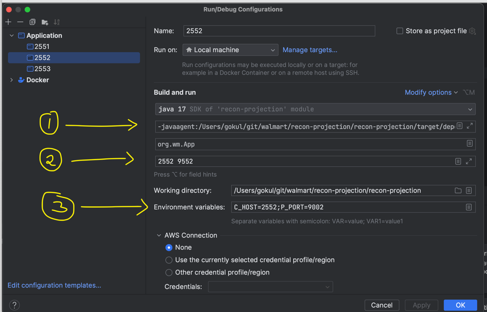

# Kafka Consumer -> EventSourcing -> Projection

This tutorial demonstrates how to efficiently consume messages using `KafkaClusterSharding`, 
process them with `EventSourcedBehavior`, and build views using `R2dbcProjection`.

More Info:
https://doc.akka.io/libraries/alpakka-kafka/current/cluster-sharding.html


### Step 1
Run the docker compose file which is configured with all dependent components and useful UI tools to access
Kafka and postgres

``docker compose up``

### Step 2

Create the required tables in postgres with following command.

``docker exec -i postgresql psql -U postgres -t < src/main/resources/create_tables_postgres.sql``

``docker exec -i postgresql psql -U postgres -t < src/main/resources/create_tables_for_projection.sql``

### Step 3

Create the required Kafka Topic. this can be done via Kafka UI.

open http://localhost:8080
goto topic tab
create `order-topic` with 10 partitions.

### step 4

Edit Configure in IntelliJ to run with 3 different configurations.

``mvn compile``

the above command would have path of the `cinnamon-agent.jar` path, copy the path.



As shown in the above image, 

1. Edit configuration, paste the cinnamon-agent.jar path in `VM options` by prepending `-javaagent:`.
EX:
-javaagent:/Users/gokul/git/walmart/recon-projection/recon-projection/target/dependency/cinnamon-agent.jar
2. add Akka remote port and management ports in the program arguments.  
3. add following ENV in the run configurations C_HOST=2551;P_PORT=9001

To run multiple instances in the cluster, clone the configuration update the ports to different in each configurations

Now clone the above configurations two more time. then edit C_HOST=2552;P_PORT=9002 and C_HOST=2553;P_PORT=9003
respectively.

Finally Add program arguments in the edit configuration with akka remote and management port.
Ex: 2551 9551
also, 2552 9552 and 2553 9553 in other two instances as well

### step 5

Run all the app instances three times.

### step 6

Run load by invoking following commends

```cd loadtest```

```npm install```

```node generateload.js```

### step 6

goto localhost:3000 to monitor the metrics in the grafana

